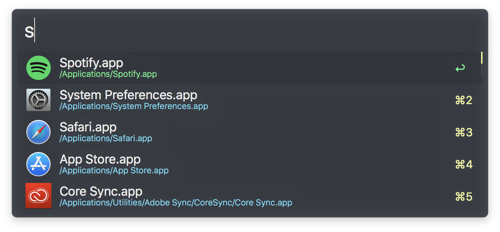

# Alfred Snazzy

This is a theme for Alfred based on the Snazzy Theme by [sindresorhus](https://github.com/sindresorhus).

## Installation

Simply double click the _Alfred Snazzy.alfredappearance_ file. Done!

## sindresorhus' other Snazzy Themes:

- [iterm2-snazzy](https://github.com/sindresorhus/iterm2-snazzy) - iTerm2 version
- [terminal-snazzy](https://github.com/sindresorhus/terminal-snazzy) - Terminal version
- [konsole-snazzy](https://github.com/miedzinski/konsole-snazzy) - Konsole version
- [vscode-snazzy](https://github.com/Tyriar/vscode-snazzy) - VS Code version
- [emacs-snazzy](https://github.com/weijiangan/emacs-snazzy) - Emacs version
- [termite-snazzy](https://github.com/kbobrowski/termite-snazzy) - Termite version

## License

MIT © [Paul Fauth-Mayer](https://github.com/paulfauthmayer)
